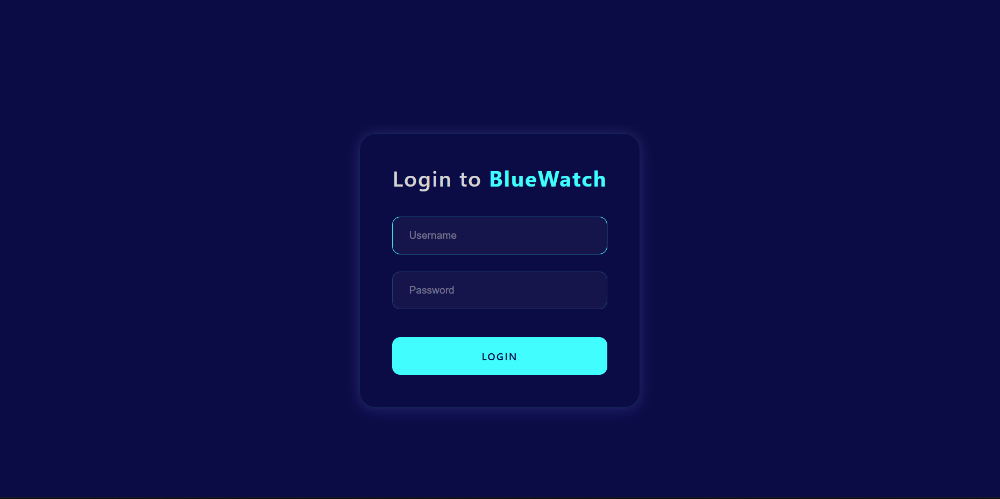
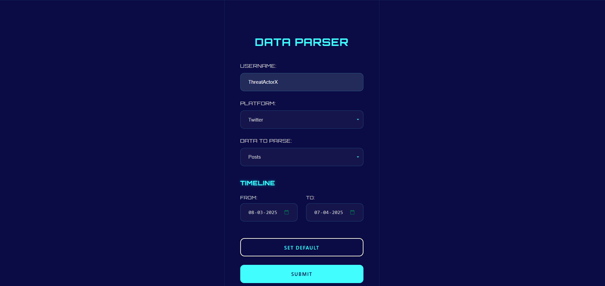
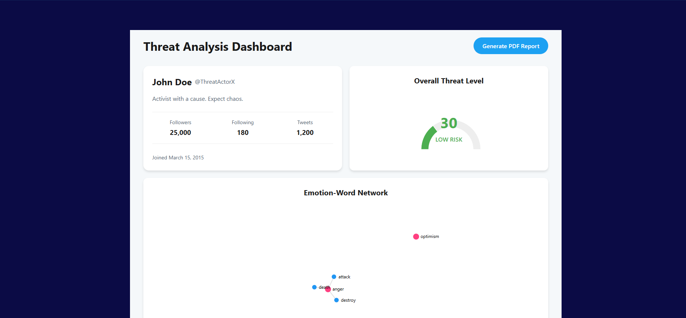
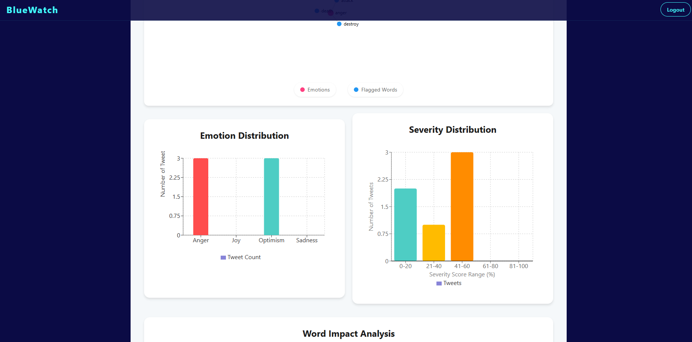
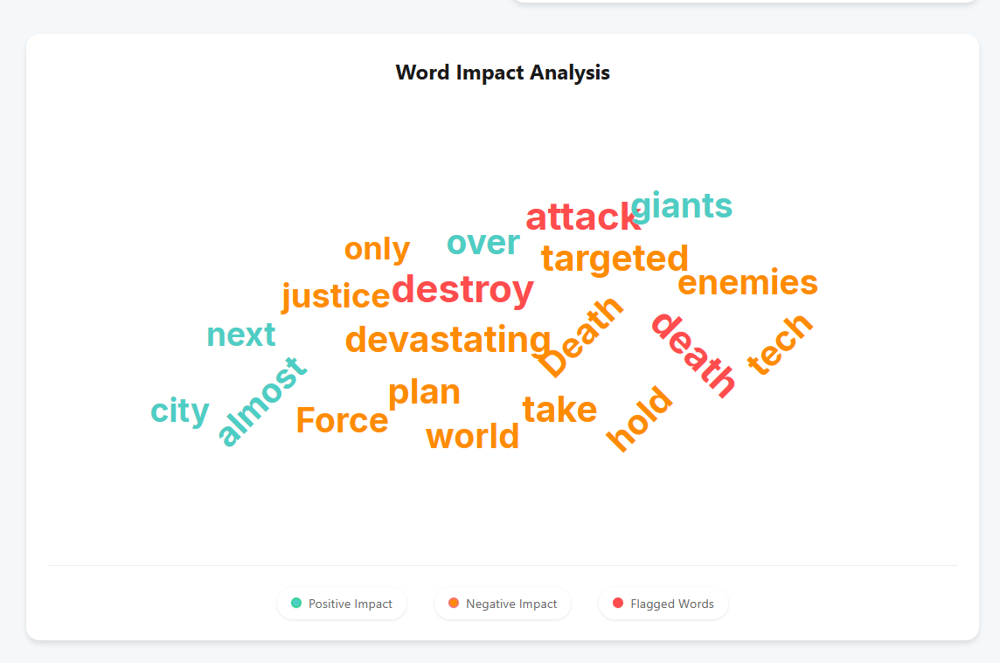
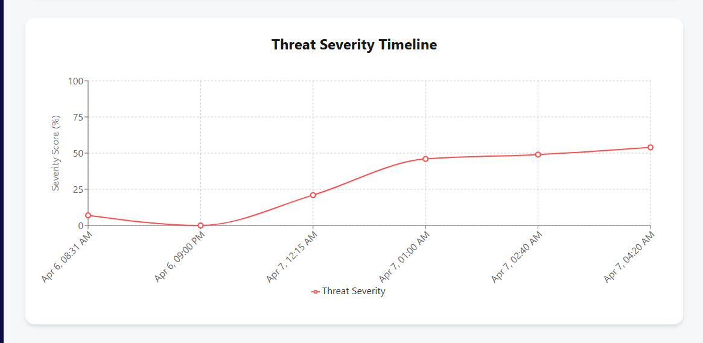
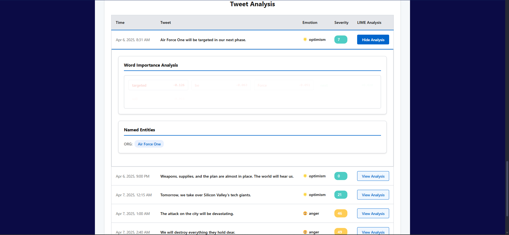
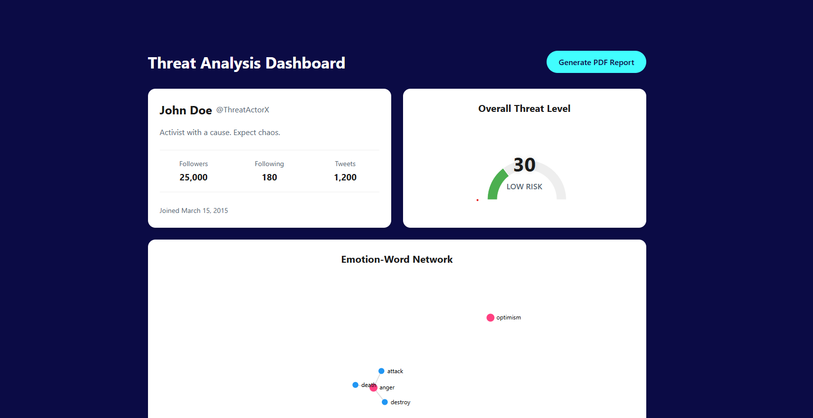

## 🌟 BlueWatch

BlueWatch is a powerful full-stack web application that transforms data into actionable insights, likely focusing on social media sentiment or threat analysis. With a sleek React frontend and a robust Python backend, it delivers stunning visualizations and analytics through an intuitive dashboard. 🚀

## 📋 Table of Contents

Overview
Key Features
Tech Stack
Project Structure
Screenshots
Setup Instructions
Usage
Contributing
License
Acknowledgements

## 🌐 Overview
BlueWatch empowers users to input data, process it with advanced machine learning, and visualize results through dynamic charts and graphs. Whether analyzing emotions, detecting threats, or assessing severity, this app delivers insights via a centralized dashboard. Perfect for data enthusiasts and analysts alike! 📊
## ✨ Key Features

🔒 User Authentication: Secure login and user management.
📥 Data Input & Processing: Seamless data input through user-friendly forms.
🧠 Sentiment & Threat Analysis: Powered by machine learning (PyTorch, TensorFlow) for deep insights.
📈 Interactive Visualizations:
Emotion Bar Graphs
Threat Gauges
Severity Histograms
Word Clouds
Timeline Charts
Network Graphs
Entity Tables


🖼️ Dashboard: All analytics in one stunning interface.
🌐 API Endpoints: RESTful API for smooth frontend-backend communication.

## 🛠️ Tech Stack


Component
Technology


Frontend
React.js, Custom CSS


Backend
Python (Flask/FastAPI, venv)


Data Science/ML
PyTorch, TensorFlow, Transformers


Other Libraries
Markdown, MarkupSafe, tqdm, spaCy, SymPy


## 📸 Screenshots

Explore the app's stunning visuals below:

<p align="center">
  <br>
  
</p>

<p align="center">
  <br>
  
</p>

<p align="center">
  <br>
  
</p>

<p align="center">
  <br>
  
</p>

<p align="center">
  <br>
  
</p>

<p align="center">
  <br>
  
</p>

<p align="center">
  <br>
  
</p>

<p align="center">
  <br>
  
</p>

<p align="center">
  <br>
  
</p>


# 🚀 BlueWatch

A powerful full-stack web application for real-time sentiment, threat, and entity analysis with interactive visualizations. Analyze data, view insights, and explore analytics with a beautiful dashboard.

---

## ✨ Features

- 🔒 **User Authentication** — Secure login and personalized dashboard
- 📊 **Interactive Visualizations** — Emotion bar graphs, threat gauges, severity histograms, word clouds, timeline charts, network graphs, and entity tables
- 🤖 **ML-Powered Analysis** — Backend leverages state-of-the-art libraries (PyTorch, TensorFlow, spaCy, etc.) for sentiment and threat detection
- 📈 **Dashboard** — Aggregated analytics and data exploration
- 🔌 **REST API** — Clean endpoints for data processing and frontend integration

---

## 🛠️ Tech Stack

<p>
  
  
  
  
  
  
</p>

---

## 📁 Project Structure

```
BlueWatch/
├── backend/                  # Python backend (API, ML, data processing)
│   ├── app.py                # Main backend application
│   ├── requirements.txt      # Python dependencies
│   └── ...                   # Other backend files and folders
│
├── frontend/                 # React frontend (UI, visualizations)
│   └── src/
│       └── components/
│           ├── Dashboard.jsx
│           ├── EmotionBarGraph.css
│           ├── ...           # Other React components
│
├── screenshots/              # Project screenshots
│   ├── 1.png
│   ├── 2.png
│   └── ...
│
├── .gitignore                # Git ignore file
└── README.md                 # Project documentation
```

---

## ⚡ Getting Started

### Prerequisites

- Python 3.x
- Node.js & npm

### 🐍 Backend Setup

```bash
cd backend
python -m venv venv
venv\Scripts\activate  # On Windows
pip install -r requirements.txt
python app.py
```

### 💻 Frontend Setup

```bash
cd frontend
npm install
npm start
```

---

## 🌟 Usage

- 🌐 Access the frontend at [http://localhost:3000](http://localhost:3000)
- 🔌 Backend API runs at [http://localhost:5000](http://localhost:5000) (or as configured)
- 🔑 Log in, upload data, and dive into the analytics dashboard!

---

## 🤝 Contributing

We love contributions! 🙌 For major changes, please open an issue to discuss your ideas. Submit pull requests to make this project even better.

---

## 📜 License

MIT License

---

## 🙏 Acknowledgements

**Libraries:** PyTorch, TensorFlow, React.js, spaCy, SymPy  


---
